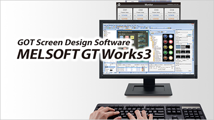

# __MELFA ROS2 Masterclass 2024: Empowering Innovations with MELSOFT Simulators__
    
## __1. Introduction to MELSOFT__

This repository was used for the Masterclass conducted at [ROS Industrial Asia Pacific Summit 2024](https://rosindustrial.org/events/2024/2/1/ros-industrial-consortium-asia-pacific-annual-summit-2024).

MELSOFT is a collection of Mitsubishi Electric engineering softwares that augment our state of art industrial hardware products to power industry leading automation solutions. 
- [Learn more about MELSOFT](https://www.mitsubishielectric.com/fa/products/index.html#section_software)

### __MELSOFT RT Toolbox3 (Robot)__ 

__Total engineering support software for MELFA Robots__

 

&#10146; Notable features

- Create and edit programs without teach pendant
- Operating environment validation with _3D viewer_
- Accurate simulation of robot kinematics and dynamics
- Log & Optimize cycle times with _Real Time Monitoring_
- Monitoring & log robots states and faults during operations
- Click on the image below to learn more!
  
 

### __MELSOFT GX Works3 (PLC)__

__Reducing development costs through intuitive engineering with MELSEC Programmable Logic Controllers__

&#10146; Notable features

- Graphic-based configuration realizing easier programming
- Integrated motion-control system configuration
- Complies with IEC 61131-3
- Global realization by multi-language support
- Click on the image below to learn more!
  
 

### __MELSOFT GT Works3 (HMI)__

__Professional designs. Maximized efficiency. Intuitive operations. Made possible with GOT Human Machine Interfaces.__

 

&#10146; Notable features

- Data collection, visualization, analysis
- Data manipulation with C language scripts
- Supports custom audio files
- Configure built-in FTP, HTTP and OPC servers
- Click on the image below to learn more!
  

## __2. MELSOFT Project Files__

MELFA ROS2 Masterclass 2024 utilizes physical and simulated hardware to provide a robust platform with hardware accurate digital twins for MELSEC, MELFA and GOT products. This section describes the purpose and functionality of the included MELSOFT project files.

### __RV-5AS__
- [MELSOFT RT Toolbox3](https://www.mitsubishielectric.com/fa/products/rbt/robot/smerit/rt3/index.html) project folder for [MELFA](https://www.mitsubishielectric.com/fa/products/rbt/robot/index.html) RV-5AS collaborate robot. 
- This project folder is used to configure and program a physical RV-5AS robot used in the Masterclass.
- This project file is used to create and configure a simulated RV-5AS robot that is identical to the physical robot used in the Masterclass.

 

### __FX5UJ_hw.gx3__
- [MELSOFT GX Works3](https://www.mitsubishielectric.com/fa/products/cnt/plceng/smerit/gx_works3/index.html) project file for [MELSEC IQ-F](https://www.mitsubishielectric.com/fa/products/cnt/plcf/items/index.html) FX5UJ programmable logic controller.
- This project file is used to configure and program a physical FX5UJ PLC used in the Masterclass.
- This project file is used to create and configure a simulated FX5UJ PLC that is identical to the physical PLC used in the Masterclass.

 

### __GT27_hw.GTX__
- [MELSOFT GT works 3](https://www.mitsubishielectric.com/fa/products/hmi/got/smerit/gt_works3/index.html) project file for [GOT](https://www.mitsubishielectric.com/fa/products/hmi/got/pmerit/index.html) GT2715-XTBA Human Machine Interface. 
- This project file is a modification of the [GOT2000 sample screen data for CR800-D series controller](https://www.mitsubishielectric.co.jp/fa/download/software/detailsearch.do?mode=software&kisyu=/robot&shiryoid=0000000079&kisyuid=0&lang=0&select=0&softid=0&infostatus=0_0_0&viewradio=0&viewstatus=0&viewpos=0) with a custom screen to interface with MELFA ROS2 Driver and associated I/O controllers.

 

### __GT27_sim.GTX__
- [MELSOFT GT works 3](https://www.mitsubishielectric.com/fa/products/hmi/got/smerit/gt_works3/index.html) project file for [GOT](https://www.mitsubishielectric.com/fa/products/hmi/got/pmerit/index.html) simulation.
- This project file is a modification of the GT27_hw.GTX with better compatibility with other MELSOFT simulators.

 

## __3. MELFA ROS2 Packages__

### melfa_masterclass_msgs
- Custom ROS2 interfaces for this Masterclass

### melfa_rv5as_masterclass
- Executables and launch files for ROS2 programs used during the Masterclass

## __4. Usage and Installation__

&#10146; Note: This repository supports Ubuntu 22.04 for ROS2 Humble and Windows10 for MELSOFT __ONLY__. Using a different operating environment may cause in unintended results.

- [Masterclass content](./doc/melfa_masterclass.md): Class content with instructions and descriptions
- [MELFA ROS2 & MELSOFT setup guide](./doc/melsoft_setup.md): Setup and configuration of MELSOFT simulators

## __5. Other MELFA ROS2 Related Repositories__

- [MELFA ROS2 Driver](https://github.com/Mitsubishi-Electric-Asia/melfa_ros2_driver/tree/humble) : Official MELFA ROS2 Driver.

 
