# __MELFA ROS2 Masterclass 2024__

This document provides a guided tutorial for this MELFA ROS2 Masterclass. For setup instructions, refer to [MELSOFT Simulators Setup Guide](../doc/melsoft_setup.md).
## __Overview__

This document contains 3 chapters. By the end of this tutorial, you will be able to create your own MELFA ROS2 application and create a system accurate simulation with MELSOFT Simulators.

## __1. Connect to MELSOFT Simulators__

This section provides a guide to connect to MELSOFT RT Toolbox3 Simulator.

MELSOFT RT Toolbox3 creates a system simulation of the RV-5AS collaborative robot. The simulator simulates the _Real Time External Command_ Ethernet function, allowing ROS2 to connect to the simulation as if it is a real physical robot.

### 1. Hardware Connection

Ensure that your Ubuntu and Windows10 devices are connected to the same LAN.

Ensure that your Windows10 device is able to ping your Ubuntu device. Your Ubuntu device may not be able to ping your Windows10 device due to some Windows firewall configurations. If your Windows10 device is able to ping your Ubuntu device, your devices are connected.

Refer to [RT Toolbox3 Simulator Setup](./../../melfa_ros2_driver-1.0.4/doc/rt_sim_setup.md) to set up connection to MELSOFT RT Simulator. This link will work if melfa_ros2_driver is in the same workspace

### 2. Launch MELFA ROS2 Driver [Terminal 1]

Open a new terminal. Source your MELFA workspace and connect to the simulation with the command below.
```
# Terminal 1

ros2 launch melfa_bringup rv5as_control.launch.py use_fake_hardware:=false robot_ip:=<MELSOFT_PC_IP_address>
```
Example:
```
# Terminal 1

ros2 launch melfa_bringup rv5as_control.launch.py use_fake_hardware:=false robot_ip:=192.168.3.200
```
<br/>
You will be greeted with a block of text. Do not be alarmed as the packet losses are caused by Windows not being "real-time" which results in missed replies back to MELFA ROS2 which is real-time. Running RT Toolbox3 as administrator may reduce the packet loss frequency but your mileage may vary.

<br/>
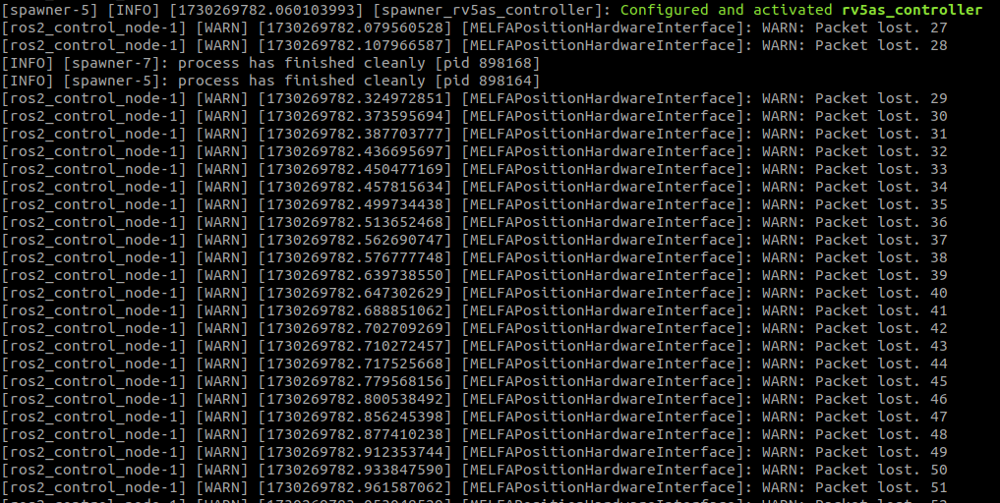

</br>

### 3. Run plc_ node [Terminal 2]

Open a new terminal. Source your MELFA workspace and run the command below.
```
# Terminal 2

ros2 run melfa_rv5as_masterclass plc_ 
```
<br/>
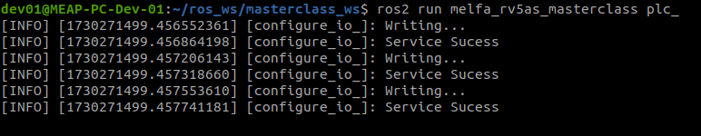

</br>

### 4. Run hmi_ node [Terminal 3]

Open a new terminal. Source your MELFA workspace and run the command below.
```
# Terminal 3

ros2 run melfa_rv5as_masterclass hmi_ 
```
<br/>
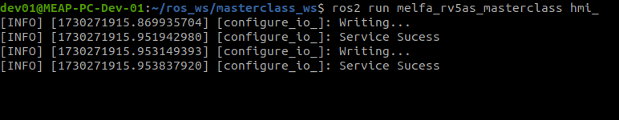

</br>

## __2. Interface with MELSOFT Simulators with ROS2 Command Line Interface__

This section provides a guide to interface with the MELSOFT Simulators on the Windows10 device.

### Open a new Terminal [Terminal 4]

### Exercise 1: Read Sensor States

In this exercise, you will toggle the PLC input bus to simulate sensor inputs and observe the change of sensor states reflected in ROS2.

#### On the Windows device

In the GX Works3 window, select [Online]&#8594;[Monitor]&#8594;[Device/Buffer Memory Batch Monitor].

<br/>
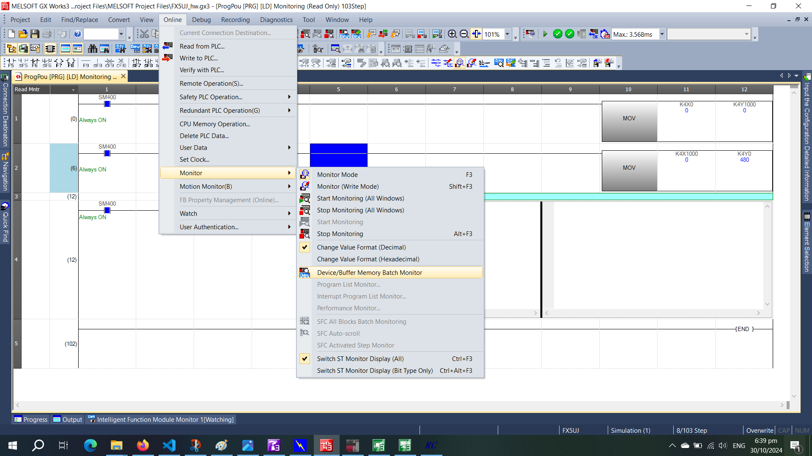

</br>

In the new tab, enter "x0" in [Device Name].

You can toggle the x memory addresses by double-clicking them. Do note that only "x0" to "x7" are mapped to the plc_ node is this tutorial. 

The state of the sensors are reflected in GT Simulator. [X0], [x1], [x2] &#8594; [SLP3], [Front], [Right].

<br/>
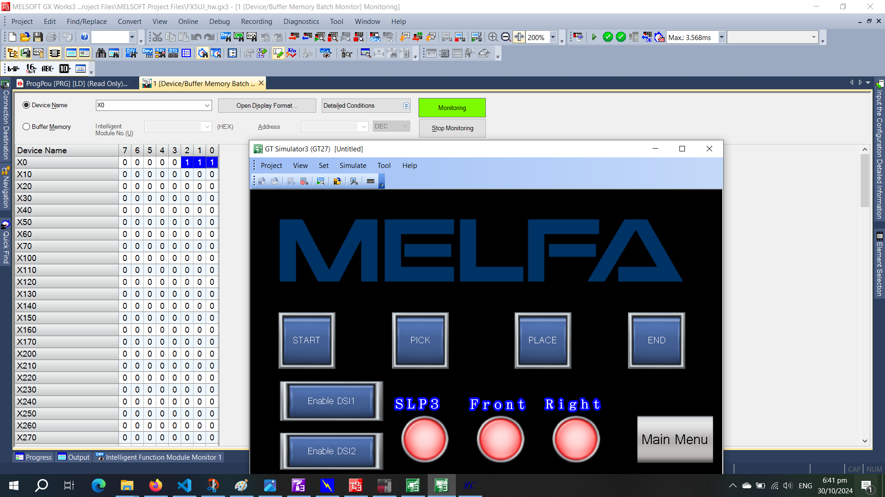

</br>

#### On the Ubuntu device

Run the command below.
```
# Terminal 4

ros2 topic echo /plc_/optical_sensor 
```
You will see the following:

```
# Terminal 4

---
sensor_0: true
sensor_1: true
sensor_2: true
sensor_3: false
sensor_4: false
sensor_5: false
sensor_6: false
sensor_7: false
---
```
For this tutorial only the first 3 sensors are used.

#### Explanation

These sensors mimic a set of optical sensors. The sensor states are communicated to the MELFA robot via a simulated CC-Link IE Field Basic industrial protocol. These sensor states are communicated to MELFA ROS2 Driver via "misc1_io" controller. Each MELFA ROS2 Driver I/O controllers have a 16-bit bus. The "misc1_io" controller is reading a 16-bit integer from the robot controller, which is reflected when the following command is ran. However, in the node "plc_", only the first 8 bits are allocated to SensorState.msg.

Run the following command to observe I/O communication for the sensors.
```
# Terminal 4

ros2 topic echo /gpio_controller/misc1_io_state 
```

You will see the following

```
# Terminal 4

---
interface_name: Misc1 IO State
bitid: 6000
bitmask: 0
bit_send_type: MXT_IO_IN
input_data: 7
output_data: 0
---
```
In this example, the integer '7' is representing 0b111 which are the states of the first 3 sensors. MELFA ROS2 Driver I/O controllers are 16-bit interfaces, therefore only x0~x7,x10~x17 are read by misc1_io.


### Exercise 2: Read Safety States

In this exercise, you will toggle the robot safety states using GT Simulator and observe the change in safety states reflected in ROS2.

#### On the Windows device

You can toggle the safety states by clicking "Enable DSI1" and "Enable DSI2". DSI2 will be enabled when the "Enable DSI2" push button and SLP3 sensor are active. This mimics a safety sensor.

<br/>
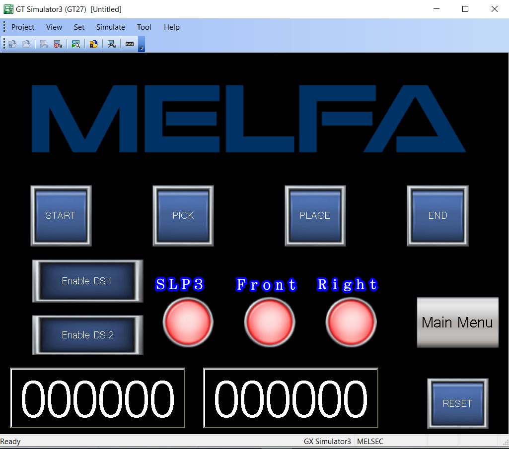

</br>

#### On the Ubuntu device

Run the command below.
```
# Terminal 4

ros2 topic echo /plc_/safety_state
```
You will see the following.
```
# Terminal 4

---
dsi_1: true
dsi_2: true
dsi_3: true
dsi_4: true
dsi_5: true
dsi_6: true
dsi_7: true
dsi_8: true
---
```
#### Explanation

The safety states are read directly from MELFA robot via MELFA ROS2 Driver "safety_io" controller. Safety states are activated by default in accordance to industry standards. The GX Simulator disables the safety states via a simulated 24VDC wired relay and activates the safety states when the corresponding push buttons are toggled on GT Simulator. 

The "safety_io" controller is reading a 16-bit integer from the robot controller, which is reflected when the following command is executed.
```
# Terminal 4

ros2 topic echo /gpio_controller/safety_io_state
```

### Exercise 3: Operate Gripper 

In this exercise, you will toggle gripper controls using ROS2 CLI and observe the change in gripper states reflected in RT Toolbox3 simulator.

#### On the Windows device

Navigate to "RT Toolbox3" and select "HAND" on the "operation panel" as seen in the image below. If you are unable to find the "operation panel", in "RT Toolbox3" top bar, click on [Online]&#8594;[Show/Hide OP].

<br/>
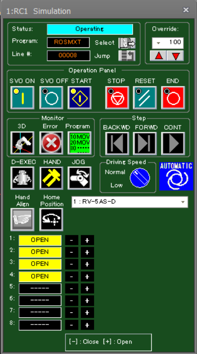

</br>

Take note of the "Hand states". By default, they should show "OPEN" with a yellow background.

#### On the Ubuntu device

Run the command below.
```
# Terminal 4

ros2 topic pub /plc_/gripper_command melfa_masterclass_msgs/msg/GripperState '{double_solenoid: True, hand_1: True, hand_2: True, hand_3: True, hand_4: True, hand_5: False, hand_6: False, hand_7: False, hand_8: False}'
```
You will notice that all the "Hand states" have change to "CLOSE" with a blue background.

#### Explanation

MELFA robots have double solenoid "Hand" settings by default, 2 bits are required to trigger 1 "hand". For double solenoid, 0b01 for Open and 0b10 for Close. For single solenoid, 0b0 for Open and 0b1 for Close. The MELFA RV-5AS robot used in this tutorial has an 8-bit bus assigned to gripper control which results in either 4 double solenoid "hands" or 8 single solenoid "hands". 

To examine the I/O writes for gripper control, run the following commands

```
# Terminal 4

ros2 topic echo /gpio_controller/hand_io_state 
```
You will see the following.

```
# Terminal 4
---
interface_name: Hand IO State
bitid: 900
bitmask: 255
bit_send_type: MXT_IO_OUT
input_data: 0
output_data: 170
---
```
Now you can publish to the gripper_command topic in another terminal and see a reflection of the gripper states as values in the robot memory bus. It is recommended to use the Ubuntu "Programming calculator" to view the integer in binary to observe the solenoid states.


### Exercise 4: Read Task Command

In this exercise, you will trigger push buttons on GT Simulator to send task commands to MELFA ROS2.

#### On the Windows device

Navigate to GT Simulator. For this exercise, click and hold on the [START], [PICK], [PLACE] and [END] push buttons on GT Simulator.

<br/>
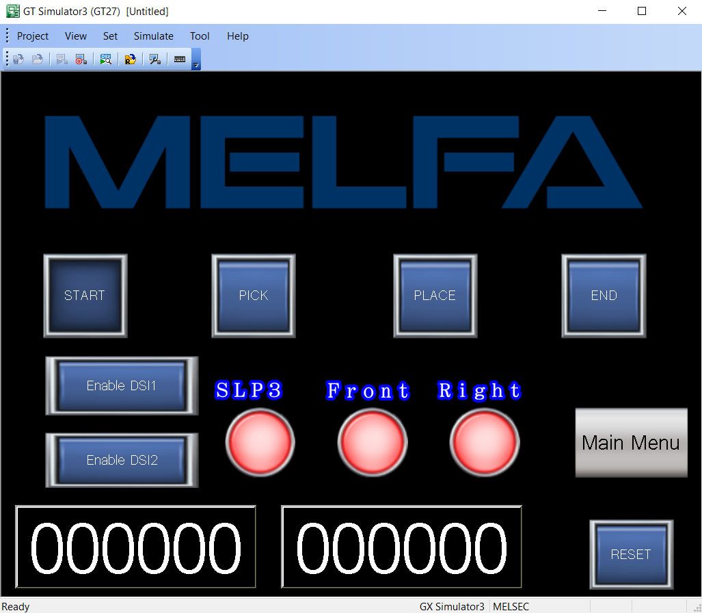

</br>

#### On the Ubuntu device

While a push button is triggered in GT Simulator on the Windows device, observe __[Terminal 3]__ where hmi_ node is running.

You will observe similar console prints to the ones shown below.

```
# Terminal 3

[INFO] [1730438161.941162684] [configure_io_]: Writing...
[INFO] [1730438162.079273678] [configure_io_]: Service Success
[INFO] [1730438162.080940112] [configure_io_]: Writing...
[INFO] [1730438162.081360671] [configure_io_]: Service Success
[INFO] [1730438167.747294688] [push_button_callback]: Start received
[INFO] [1730438170.624286178] [push_button_callback]: Pick Task received
[INFO] [1730438170.631344504] [push_button_callback]: Pick Task received
[INFO] [1730438170.638281260] [push_button_callback]: Pick Task received
[INFO] [1730438170.645289435] [push_button_callback]: Pick Task received
[INFO] [1730438170.652133983] [push_button_callback]: Pick Task received
```

#### Explanation

Each push buttons are assigned to a bit address in the Simulator which is communicated to MELFA and read by MELFA ROS2 Driver. The hmi_ node reads the I/O controller state and publishes to /task_command topic and the task command is reflected in the console prints above. The task command will be used in the tutorial application to toggle different motion plans.

Run the command below to observe the change in I/O value input value which is assigned to the 4 push buttons in GT Simulator.

```
# Terminal 4

ros2 topic echo /gpio_controller/misc3_io_state
```

### Exercise 5: Read/Write Analog Data

In this exercise, you will read and write analog data between MELFA ROS2 and MELSOFT simulators.

#### On the Windows device

Navigate to GT Simulator. Click on the left data input block and enter a 16-bit integer by clicking on the number pad. Click [Enter] to set the value.

<br/>
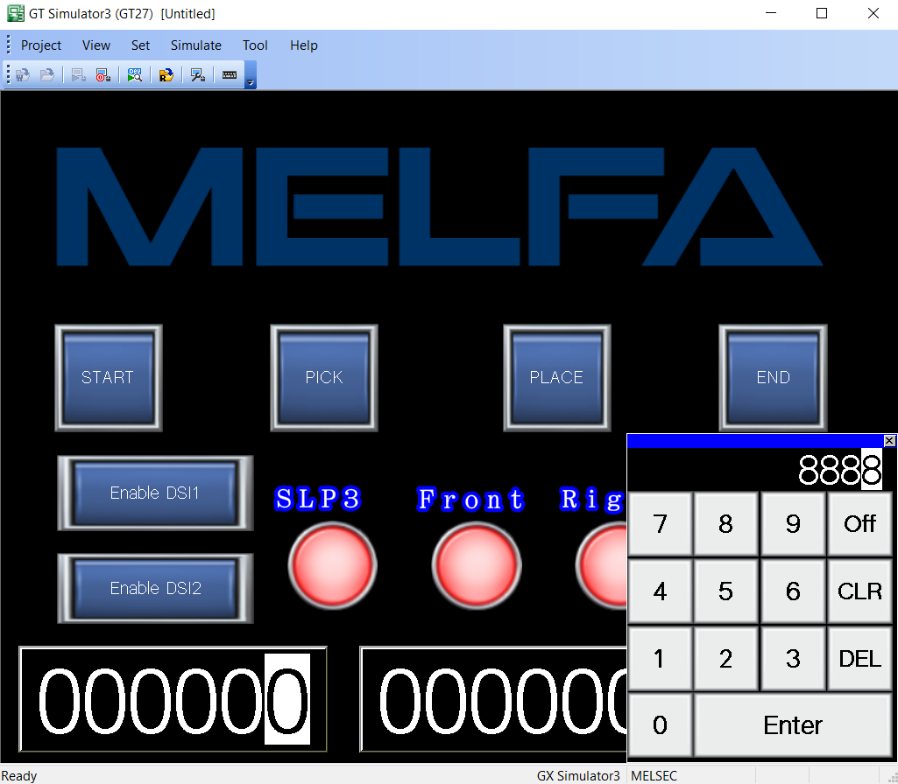

</br>

In the right data block, a similar number but round off to the nearest 100 will appear.

#### Explanation

The left data block is an input block that assigns a value to memory. This data is mapped to MELFA robot and read by MELFA ROS2 Driver in "misc3_io" controller. The hmi_ node reads the state of this controller and either rounds up or down the value to the nearest 100. The rounded value is written back into MELFA robot, communicated to GT Simulator and displayed in the right data block.

The MELFA ROS2 Driver uses the rtexc API from the MELFA Ethernet SDK which allows the external device to write to output and read from input of the same address in one cycle.

To observe this, run the following command.

```
# Terminal 4

ros2 topic echo /gpio_controller/plc_link_io_state
```
You will see the following.

```
# Terminal 4

---
interface_name: PLC Link IO State
bitid: 10800
bitmask: 65535
bit_send_type: MXT_IO_IN
input_data: 8888
output_data: 0
---
```
Do note that "output_data: 0" is not accurate as the "plc_link_io" is not reading output data. Therefore, it remains at the initial value of "0". 

Possible applications that may require this:

1. MELFA ROS2 reads the encoder position of a motor from a PLC and writes an analog value to the PLC to adjust the speed of the motor.

2. MELFA ROS2 reads proximity distance data from an ultrasonic sensor from a PLC and writes an analog data to a PLC to adjust a PWM analog output.

3. Low frequency PID loop in ROS2. MELFA ROS2 reads position data from a PLC and writes effort data to the PLC to adjust PWM output. This is not recommended as PLC in-built PID functions are usually more robust and better performing.

## __3. Simple MELFA ROS2 Application with MELSOFT Simulators__

In this section, you will execute a simple MELFA ROS2 application using MELSOFT simulators. MELFA ROS2 Driver treats MELSOFT simulators as _"real"_ hardware as MELSOFT simulators are system simulators. 

### MELSOFT Simulators for Application Development

There are some caveats to using MELSOFT Simulators to simulate a complex system. One of them is the lack of memory communication between GT Simulator and RT Toolbox3 Simulator. These can be circumvented by using GX simulator as a medium to map memory addresses between GT simulator and RT Toolbox3 simulator. GX simulator has the widest compatibility with other MELSOFT simulators, these include drive systems, various industrial network protocols, CC-Link IE Time Sensitive Network and controller communication software such as MX Components. 

GX Works3 allows up to 8 GX simulators to be simulated at the same time. The newest addition to the MELSOFT suite, MELSOFT Mirror, builds on top of this capability, allowing 50 PLCs to be simulated at the same time. These PLCs can be connected to SCADA systems and visualized with MELSOFT Gemini with virtual sensors and other simulators including robots. 

In this tutorial, only the simplest of functions are used.

### 1. Launch tutorial application

Open a new terminal __[Terminal 5]__, source the melfa_ws and run the following command to launch MoveIt2.
```
# Terminal 5

ros2 launch melfa_rv5as_moveit_config rv5as_moveit.launch.py
```
Wait a few moments for MoveIt2 to launch completely. 

In __[Terminal 4]__, run the following command to launch the tutorial application.
```
# Terminal 4

ros2 launch melfa_rv5as_masterclass pick_n_place.launch.py
```
It is recommended to uncheck [Motion Planning]&#8594;[Planning Request]&#8594;[Query Goal State].

<br/>


</br>

### 2. Initializing the application

__On the Windows device__

Navigate to GT Simulator, toggle the button [Enable DSI1] and trigger the push button [START].

<br/>
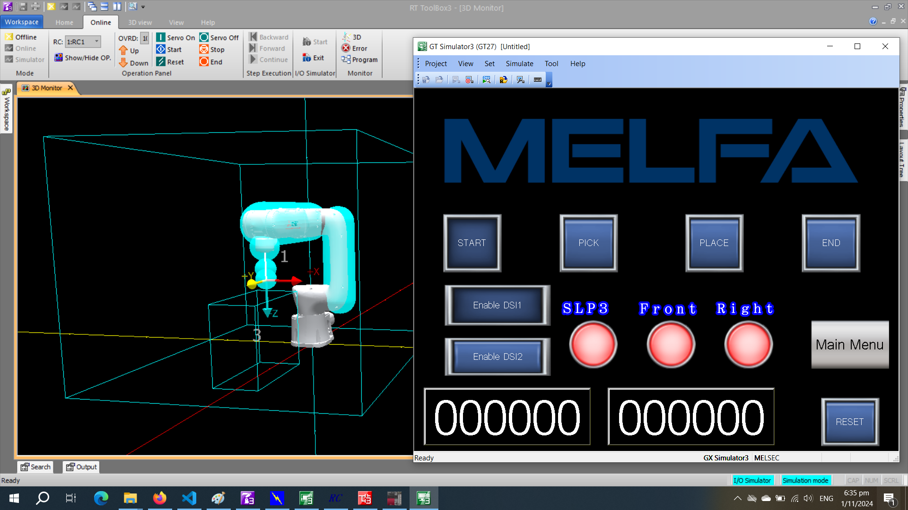

</br>

__On the Ubuntu device__

The hmi_ node detects that the [START] button is triggered and publishes to /task_command which is subscribed by pick_n_place_ node. 

pick_n_place_ node runs the initialization sequence which includes moving to robot to the initial position.

```
# Terminal 3 hmi_ node

[INFO] [1730455834.738620714] [push_button_callback]: Start received
```

```
# Terminal 4 pick_n_place_ node

[pick_n_place_-1] [INFO] [1730455865.223328622] [move_group_node]: start task
[pick_n_place_-1] [INFO] [1730455865.223378610] [move_group_node]: init joint_home0
[pick_n_place_-1] [INFO] [1730455865.223400256] [move_group_node]: set joint_home0 target
[pick_n_place_-1] [INFO] [1730455865.223610686] [move_group_interface]: MoveGroup action client/server ready
[pick_n_place_-1] [INFO] [1730455865.224448196] [move_group_interface]: Planning request accepted
[pick_n_place_-1] [INFO] [1730455865.232212057] [move_group_interface]: Planning request complete!
[pick_n_place_-1] [INFO] [1730455865.233221488] [move_group_interface]: time taken to generate plan: 0.000413502 seconds
[pick_n_place_-1] [INFO] [1730455865.233275111] [move_group_node]: plan
[pick_n_place_-1] [INFO] [1730455865.233304640] [move_group_node]: Start position
[pick_n_place_-1] [INFO] [1730455865.233997122] [move_group_interface]: Execute request accepted
[pick_n_place_-1] [INFO] [1730455865.308184511] [move_group_interface]: Execute request success!
[pick_n_place_-1] [INFO] [1730455865.308412867] [move_group_node]: execute
```

### 3. Execute Pick and Place Tasks without DSI2


#### Pick Operation

__On the Windows device__

Navigate to GT Simulator.

Trigger the push button [PICK] to execute "pick" operation.

<br/>
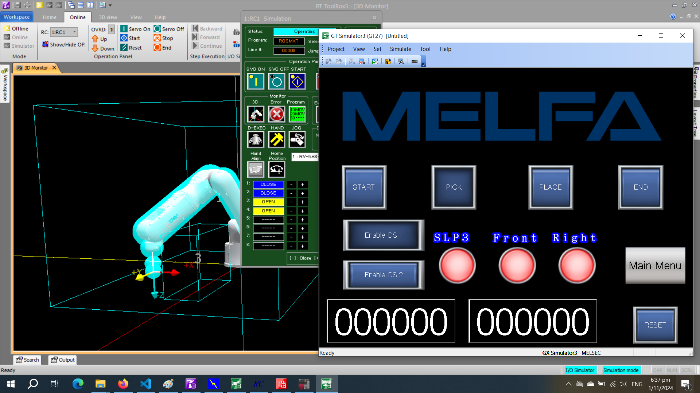

</br>

__On the Ubuntu device__

The hmi_ node detects that the [PICK] button is triggered and publishes to /task_command which is subscribed by pick_n_place_ node. 

pick_n_place_ node executes the pick operation.

```
# Terminal 3 hmi_ node

[INFO] [1730455834.738620714] [push_button_callback]: Pick received
```
```
# Terminal 4

[pick_n_place_-1] [INFO] [1730457759.832095251] [move_group_node]: pick task
[pick_n_place_-1] [INFO] [1730457759.839725445] [move_group_interface]: MoveGroup action client/server ready
[pick_n_place_-1] [INFO] [1730457759.840448606] [move_group_interface]: Planning request accepted
[pick_n_place_-1] [INFO] [1730457759.924008582] [move_group_interface]: Planning request complete!
[pick_n_place_-1] [INFO] [1730457759.924865317] [move_group_interface]: time taken to generate plan: 0.0433576 seconds
[pick_n_place_-1] [INFO] [1730457759.925639446] [move_group_interface]: Execute request accepted
[pick_n_place_-1] [INFO] [1730457765.299094180] [move_group_interface]: Execute request success!
[pick_n_place_-1] [INFO] [1730457765.305964037] [move_group_interface]: MoveGroup action client/server ready
[pick_n_place_-1] [INFO] [1730457765.306851277] [move_group_interface]: Planning request accepted
[pick_n_place_-1] [INFO] [1730457765.381458505] [move_group_interface]: Planning request complete!
[pick_n_place_-1] [INFO] [1730457765.382071814] [move_group_interface]: time taken to generate plan: 0.0400832 seconds
[pick_n_place_-1] [INFO] [1730457765.382701061] [move_group_interface]: Execute request accepted
[pick_n_place_-1] [INFO] [1730457766.208850914] [move_group_interface]: Execute request success!
[pick_n_place_-1] [INFO] [1730457766.208907259] [move_group_node]: Close Gripper
[pick_n_place_-1] [INFO] [1730457767.216971425] [move_group_interface]: MoveGroup action client/server ready
[pick_n_place_-1] [INFO] [1730457767.217536399] [move_group_interface]: Planning request accepted
[pick_n_place_-1] [INFO] [1730457767.312175429] [move_group_interface]: Planning request complete!
[pick_n_place_-1] [INFO] [1730457767.312820095] [move_group_interface]: time taken to generate plan: 0.0595169 seconds
[pick_n_place_-1] [INFO] [1730457767.313561931] [move_group_interface]: Execute request accepted
[pick_n_place_-1] [INFO] [1730457768.134132736] [move_group_interface]: Execute request success!
```

#### Place Operation

__On the Windows device__

Trigger the push button [PLACE] to execute "place" operation.

<br/>
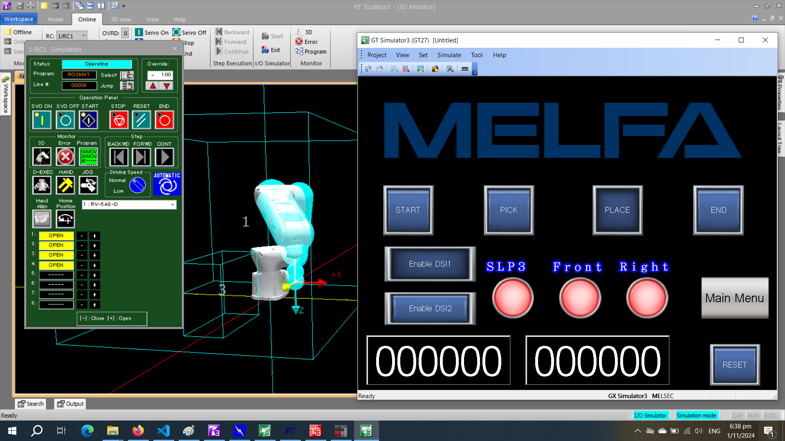

</br>

__On the Ubuntu device__

The hmi_ node detects that the [PLACE] button is triggered and publishes to /task_command which is subscribed by pick_n_place_ node. 

pick_n_place_ node executes the place operation.

```
# Terminal 3 hmi_ node

[INFO] [1730455834.738620714] [push_button_callback]: Place received
```
```
# Terminal 4

[pick_n_place_-1] [INFO] [1730457746.987162661] [move_group_node]: place task
[pick_n_place_-1] [INFO] [1730457746.994994178] [move_group_interface]: MoveGroup action client/server ready
[pick_n_place_-1] [INFO] [1730457746.995666814] [move_group_interface]: Planning request accepted
[pick_n_place_-1] [INFO] [1730457747.082947650] [move_group_interface]: Planning request complete!
[pick_n_place_-1] [INFO] [1730457747.083860738] [move_group_interface]: time taken to generate plan: 0.058738 seconds
[pick_n_place_-1] [INFO] [1730457747.084596300] [move_group_interface]: Execute request accepted
[pick_n_place_-1] [INFO] [1730457752.356883547] [move_group_interface]: Execute request success!
[pick_n_place_-1] [INFO] [1730457752.363548057] [move_group_interface]: MoveGroup action client/server ready
[pick_n_place_-1] [INFO] [1730457752.364095423] [move_group_interface]: Planning request accepted
[pick_n_place_-1] [INFO] [1730457752.458878707] [move_group_interface]: Planning request complete!
[pick_n_place_-1] [INFO] [1730457752.459323440] [move_group_interface]: time taken to generate plan: 0.0607886 seconds
[pick_n_place_-1] [INFO] [1730457752.459828180] [move_group_interface]: Execute request accepted
[pick_n_place_-1] [INFO] [1730457753.280646963] [move_group_interface]: Execute request success!
[pick_n_place_-1] [INFO] [1730457753.281817137] [move_group_node]: Open Gripper
[pick_n_place_-1] [INFO] [1730457754.289099771] [move_group_interface]: MoveGroup action client/server ready
[pick_n_place_-1] [INFO] [1730457754.289802798] [move_group_interface]: Planning request accepted
[pick_n_place_-1] [INFO] [1730457754.362794137] [move_group_interface]: Planning request complete!
[pick_n_place_-1] [INFO] [1730457754.363529537] [move_group_interface]: time taken to generate plan: 0.0435422 seconds
[pick_n_place_-1] [INFO] [1730457754.363945559] [move_group_interface]: Execute request accepted
[pick_n_place_-1] [INFO] [1730457755.184440773] [move_group_interface]: Execute request success!
```

Observe how the hand solenoids are operated by MELFA ROS2. The "hand_io" controller is a 16-bit bus which allows all hand solenoids to be triggered __at the same time__.

### 4. Execute Pick and Place Task with DSI2 and without DSI1

__DSI2__ ( _Dedicated Safety Input 2_ ) is one of the 8 configurable safety input states which can be configured to activate and deactivate __SLS__ ( _Safety Limit Speed_ ) and __SLP__ ( _Safety Limit Position_ ). SLS and SLP are __EN61800-5-2__ compliant safety functions that provide safety nets to safeguard personnel and equipment.

MELFA ROS2 Driver is able to monitor these safety states but is unable to modify them for safety reasons. This allows MELFA ROS2 Applications to react to changes in safety states and change the behavior of the robot in accordance to the safety states. In the event that the ROS2 application fails to react safely and in accordance to the intended behavior, __EN61800-5-2__ compliant MELFA safety functions will kick in to safeguard personnel and equipment.

In this tutorial application, DSI2 is used to safeguard a volume of space in front of the robot.

#### Activating DSI2 and deactivating DSI1

__On the Windows device__

Navigate to GT Simulator, engage the push button [Enable DSI2] and disengage the push button [Enable DSI1]. 

<br/>
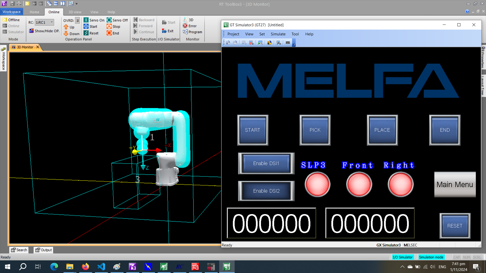

</br>

__On the Ubuntu device__

The plc_ node monitors the MELFA ROS2 Driver "safety_io" controller and detects a change in safety state. This change is communicated to pick_n_place_ node via the /plc_/safety_state topic. pick_n_place_ node places a pre-programmed collision box in the MoveIt2 planning scene. This allows the motion planner to plan around the box, preventing contact between the DSI2 protected space and the robot.

<br/>
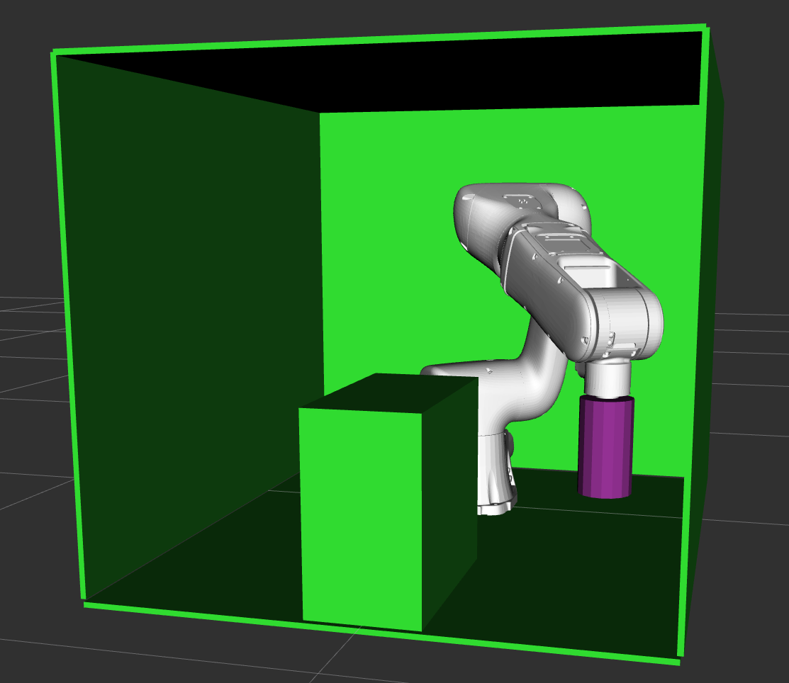

</br>

#### Pick Operation

Note: For simplicity, the console logs for this section are not included as they are similar to the previous section.

__On the Windows device__

Navigate to GT Simulator.

Trigger the push button [PICK] to execute "pick" operation.

<br/>
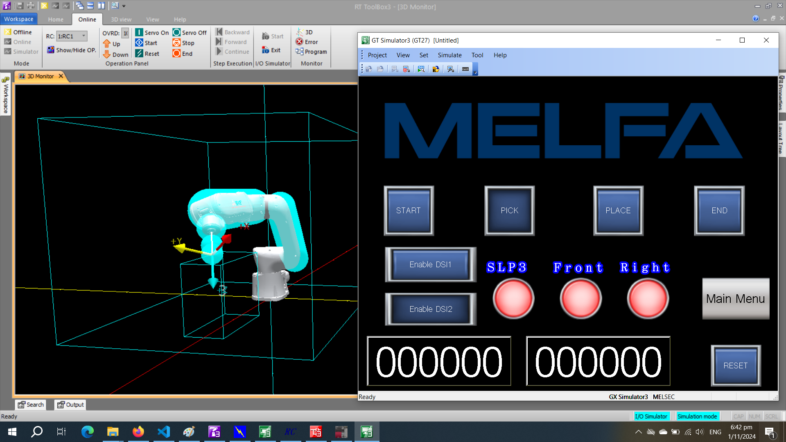

</br>

__On the Ubuntu device__

Moveit2 plans around the collision object.

<br/>
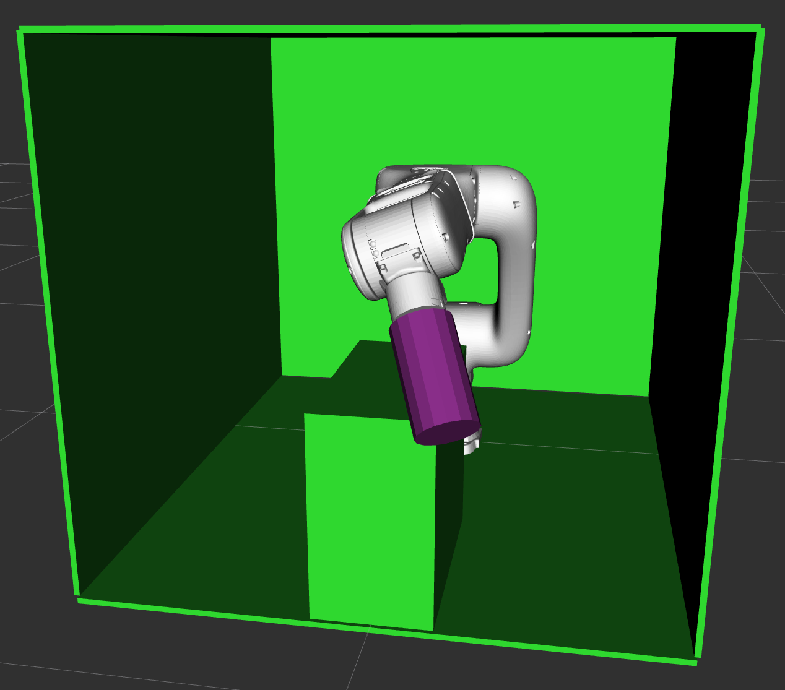

</br>


#### Place Operation

Note: For simplicity, the console logs for this section are not included as they are similar to the previous section.

__On the Windows device__

Navigate to GT Simulator.

Trigger the push button [PLACE] to execute "place" operation.

<br/>
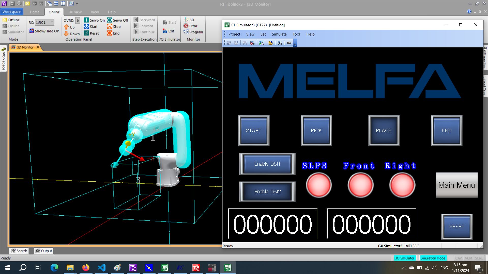

</br>

__On the Ubuntu device__

Moveit2 plans around the collision object.

<br/>
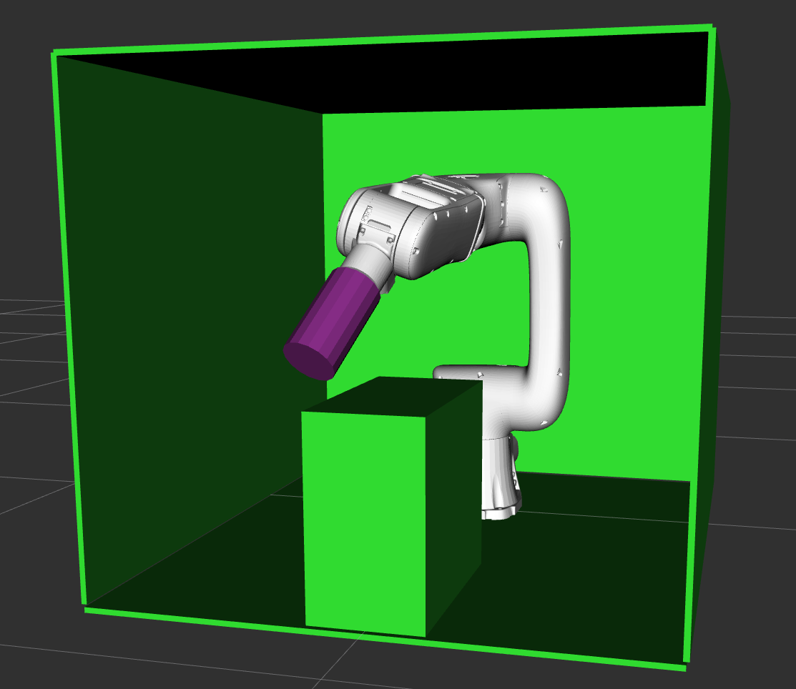

</br>

### 5. Execute Pick and Place operation with sudden activation of DSI2 and without DSI1


#### Deactivate DSI1 and DSI2

__On the Windows device__

Navigate to GT Simulator, disengage the push button [Enable DSI2] and disengage the push button [Enable DSI1]. 

<br/>


</br>

__On the Ubuntu device__

The plc_ node detects that DSI2 is no longer active and communicates this information to pick_n_place_ node which removes the collision box from the MoveIt2 planning scene.

<br/>
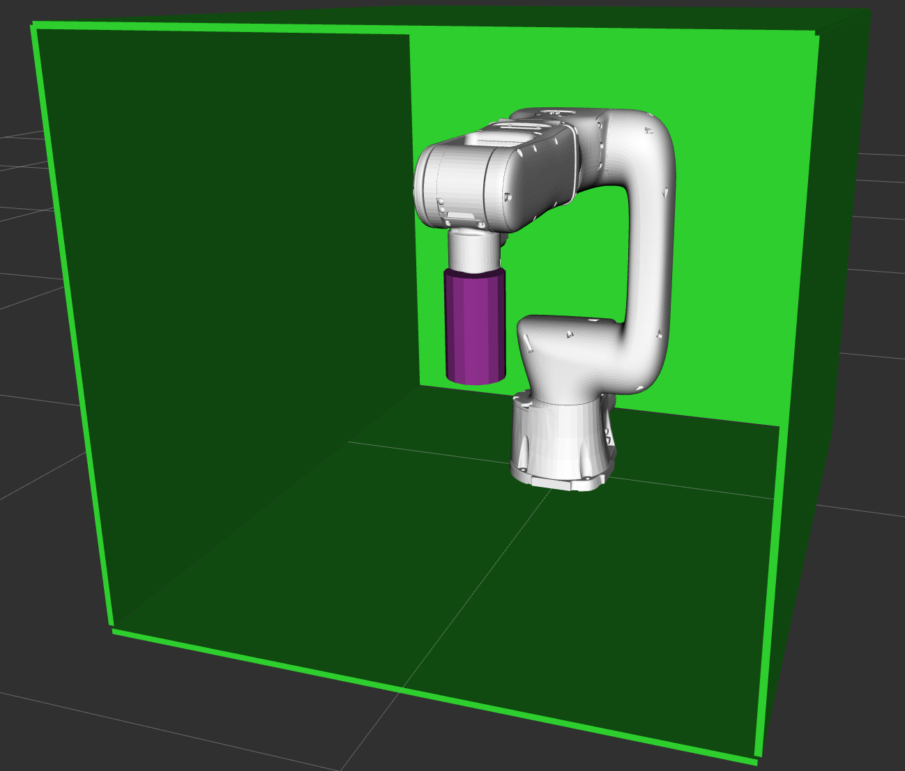

</br>

#### Pick and Place Operation with sudden activation of DSI2

__On the Windows device__

Navigate to GT simulator, trigger the push button [PICK].

Once the robot is in motion, engage the push button [Enable DSI2].

An error will occur.

<br/>
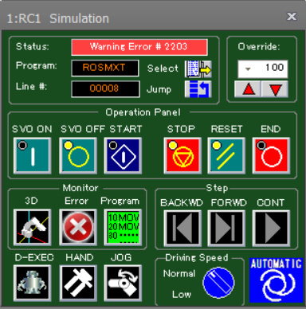

</br>

By clicking on the [Error] icon, more information about the error is shown.

<br/>
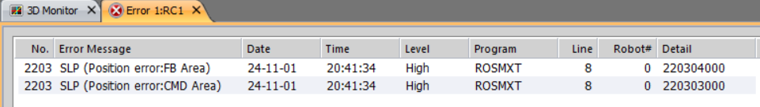

</br>

#### Explanation

When the "Pick" operation is executed, MoveIt2 generates a motion plan without taking into account the collision box. This is because DSI2 is deactivated at that point in time. During the execution of the trajectory, DSI2 is suddenly activated. The robot comes close to colliding with the DSI2 protected area, triggering SLP error in accordance with __EN61800-5-2__. This error engages the joint brakes, de-energizes the servos and kills the connection with MELFA ROS2. At this moment, the robot is motionless and in a safe state.

#### Recovery

This tutorial application does not have a built-in recovery function. 

__On the Windows device__

Select the "RESET" icon on the RT Toolbox3 Operation Panel.

__On the Ubuntu device__

Shutdown all ROS2 program in the 5 terminals and execute the following commands in the sequence provided below.

```
# Terminal 1

ros2 launch melfa_bringup rv5as_control.launch.py use_fake_hardware:=false robot_ip:=<MELSOFT_PC_IP_address>
```

```
# Terminal 2

ros2 run melfa_rv5as_masterclass plc_ 
```

```
# Terminal 3

ros2 run melfa_rv5as_masterclass hmi_ 
```

```
# Terminal 4

ros2 launch melfa_rv5as_moveit_config rv5as_moveit.launch.py
```

```
# Terminal 5

ros2 launch melfa_rv5as_masterclass pick_n_place.launch.py
```

## Conclusion

You have come to the end of __MELFA ROS2 Masterclass 2024: Empowering Innovations with MELSOFT Simulators__. I hope you enjoyed this Masterclass tutorial and learned something valuable. If you have any feedback, feel free to write a post on the discussion page. 