# __MELFA ROS2 & MELSOFT Simulator Setup__

This menu provides a guide to set up MELFA ROS2 Driver on ROS2 Humble, Ubuntu 22.04LTS and associated MELSOFT simulators in Windows10.

## __1. MELFA ROS2 Setup__

This section provides a guide to set up MELFA ROS2 Driver and MELFA ROS2 Masterclass 2024 on your __Ubuntu 22.04LTS device__.


### 1. Create your MELFA workspace
```
mkdir -p ~/melfa_ws/src
cd ~/melfa_ws/src
```
### 2. Download MELFA ROS2 Masterclass 2024 [Version 1.0.1](https://github.com/Mitsubishi-Electric-Asia/melfa_ros2_masterclass_2024/archive/refs/tags/v1.0.1.zip) from GitHub. Delete "MELSOFT Project Files.zip" as this is for the Windows10 device.

Cloning is not recommended as the latest version of MELFA ROS2 Masterclass 2024 may have compatibility issues with the latest version of MELFA ROS2 Driver.

### 3. Download MELFA ROS2 Driver [Version 1.0.4](https://github.com/Mitsubishi-Electric-Asia/melfa_ros2_driver/archive/refs/tags/v1.0.4.zip) from GitHub. 

Cloning is not recommended as the latest version of MELFA ROS2 Driver may have compatibility issues with the latest version of MELFA ROS2 Masterclass 2024.

Please refer to [MELFA ROS2 Driver Setup](./../../melfa_ros2_driver-1.0.4/doc/melfa_ros2_driver.md). This link will work if melfa_ros2_driver is in the same workspace.

### 4. Extract MELFA ROS2 Driver to melfa_ws/src.
Ensure that melfa_ros2_driver-1.0.4 and this version of melfa_ros2_masterclass_2024 are in melfa_ws/src.

### 5. Update package dependency sources
```
cd ~/melfa_ws
rosdep update
```
### 6. Install Install dependencies
```
cd ~/melfa_ws
rosdep install -r --from-paths . --ignore-src --rosdistro humble -y --skip-keys warehouse_ros_mongo
```
### 7. Open a terminal and build melfa_ws.
```
cd ~/melfa_ws
colcon build --cmake-args -DCMAKE_BUILD_TYPE=Release
```
Your MELFA workspace is ready!

## 2. MELSOFT Simulator Setup

This section provides a guide to set up MELFA ROS2 Masterclass 2024 on your __Windows10 device__.

### 1. Download MELFA ROS2 Masterclass 2024 [Version 1.0.1](https://github.com/Mitsubishi-Electric-Asia/melfa_ros2_masterclass_2024/archive/refs/tags/v1.0.1.zip) from github. 

The repository contains files for MELFA ROS2 and MELSOFT. 

### 2. Extract the files from "MELSOFT Project Files.zip".

Select "melfa_ros2_masterclass_2024-#.#.#.zip" and click on [ Extract-Compressed Folder Tools ]. Select "Extract all".

<br/>
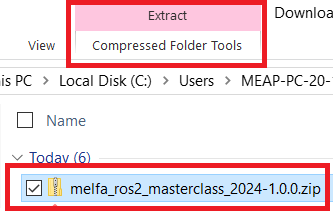

</br>

Navigate to the extracted folder and extract "MELSOFT Project Files.zip"

<br/>
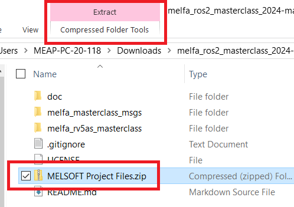

</br>

### 3. Launch GX Works3 project

Navigate to the extracted folder "MELSOFT Project Files".

<br/>
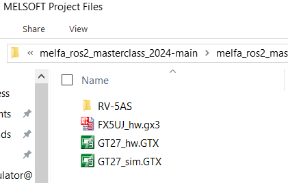

</br>

Double click "FX5UJ_hw.gx3".

Select [Debug]&#8594;[Simulation]&#8594;[Start Simulation].

<br/>
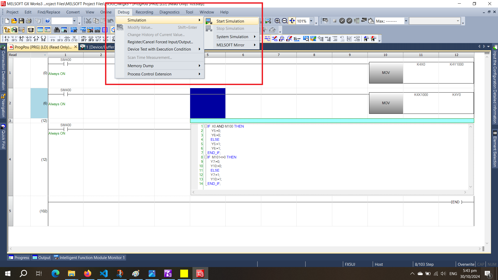

</br>

The simulator may take a few moments to get ready. When the simulator is ready, the window below will appear as is.

<br/>
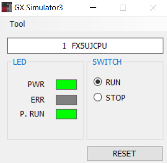

</br>

### 4. Launch GT Works3 project

Navigate to the extracted folder "MELSOFT Project Files".

<br/>


</br>

Double click "GT27_sim.GTX".

Select [Tools]&#8594;[Simulator]&#8594;[Activate].

<br/>
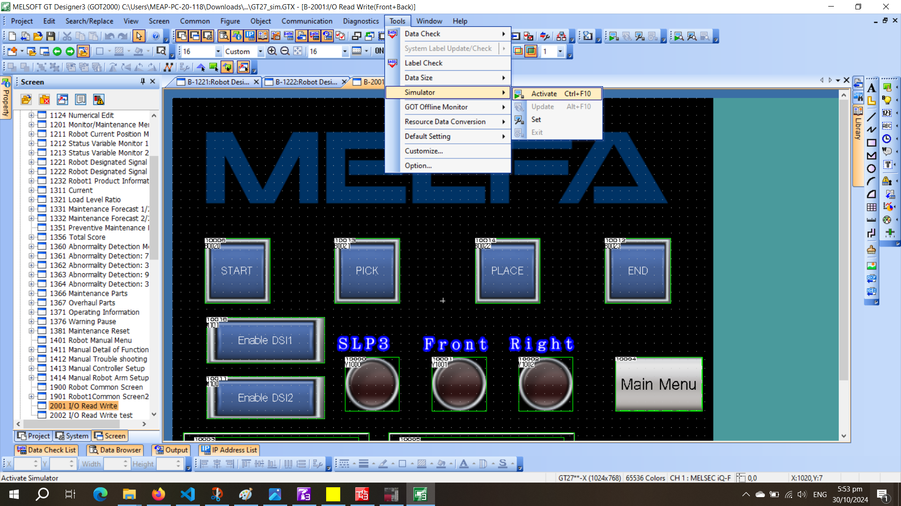

</br>

The simulator may take a few moments to get ready. When the simulator is ready, the window below will appear as is.

<br/>
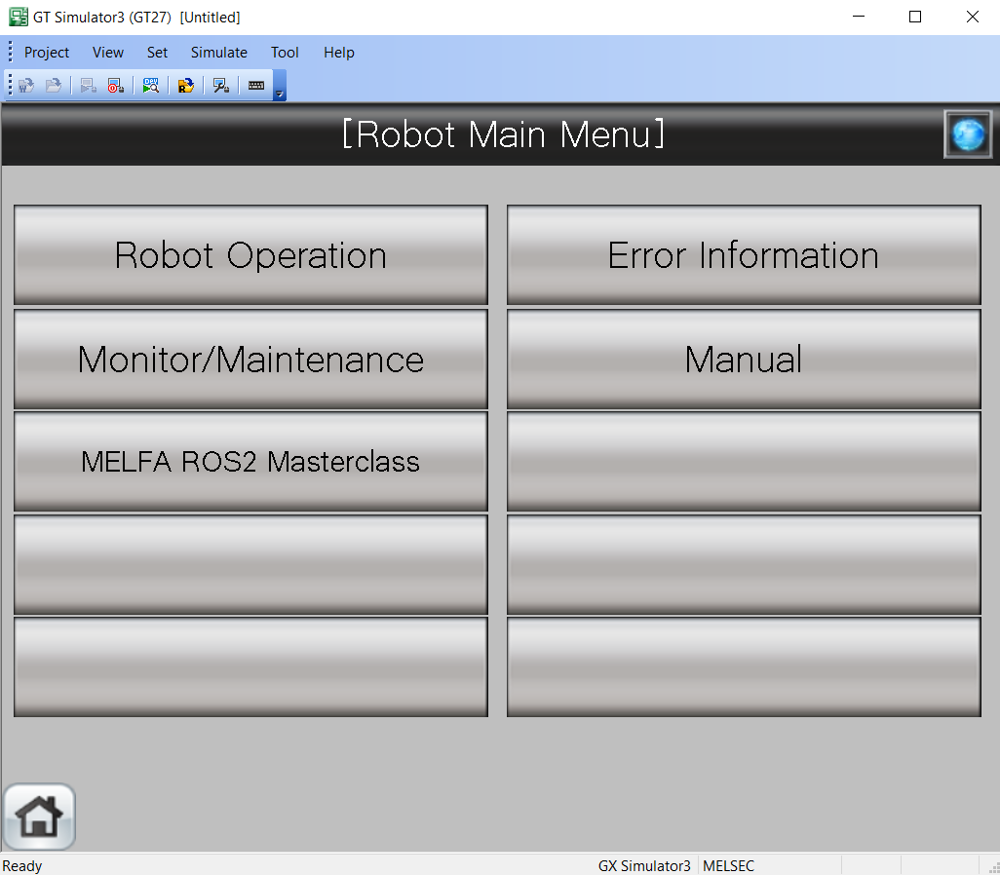

</br>

Select [MELFA ROS2 Masterclass] and the window will display the screen below.

<br/>
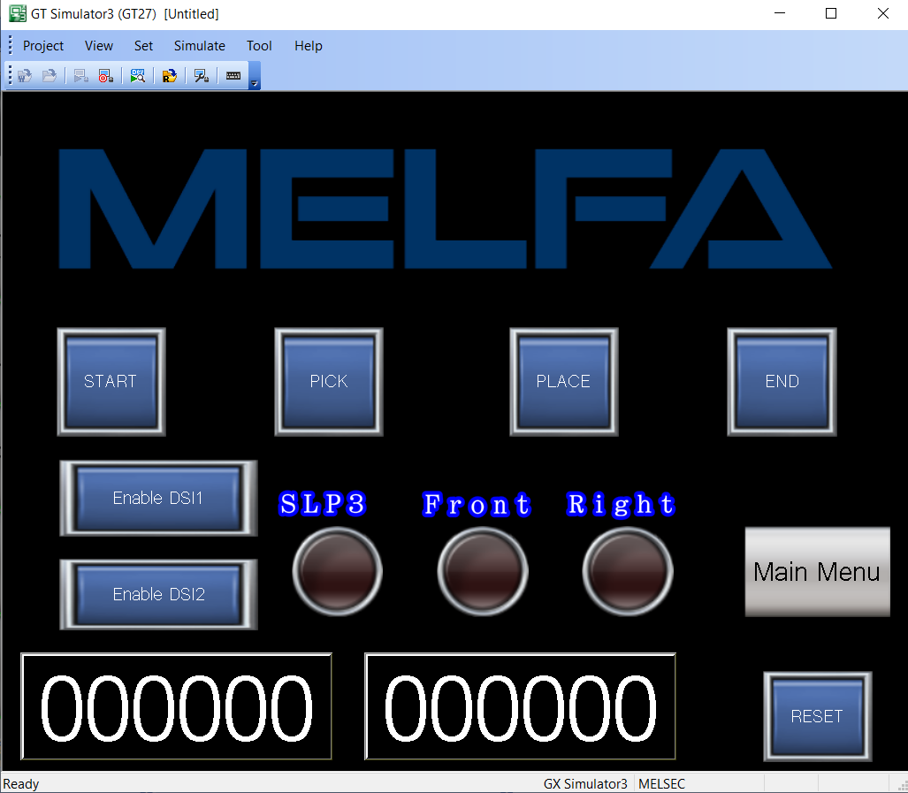

</br>


### 5. Launch RT Toolbox3
Press the [&#8862; Win] key and type RT Toolbox3. Launch RT Toolbox3 application by clicking the icon.

<br/>
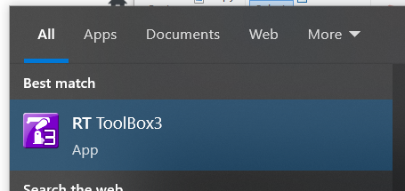

</br>

click on [Open] icon on the top left corner of the window.

<br/>
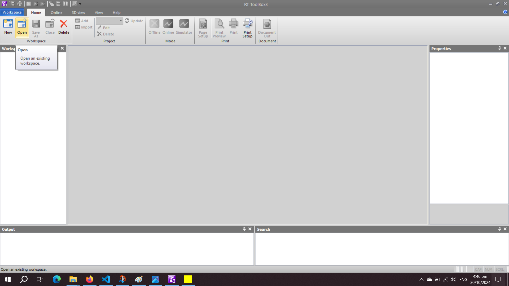

</br>

Navigate to the extracted folder for "MELSOFT Project Files". Select [Browse]. 

Select the "MELSOFT Projects Files "folder directly above the "RV-5AS" folder. Select [Ok].

Select "RV-5AS" from the list and select [Ok].

<br/>
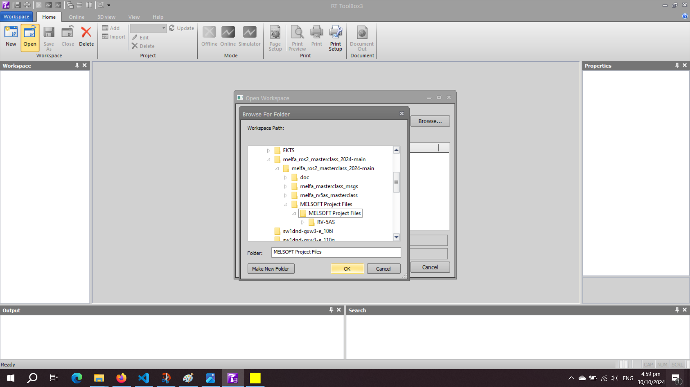

</br>

Navigate to the top panel. Select [Home]&#8594;[Simulator]

Check "Start I/O Simulator with definition file used last." and select [Ok].

<br/>
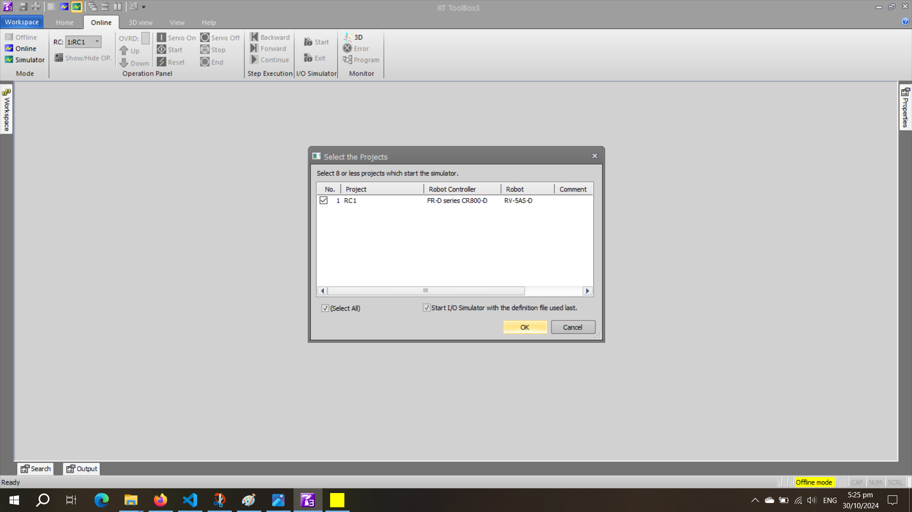

</br>

You will be greeted by a set of windows as shown below. Arrange them to your preference.

<br/>
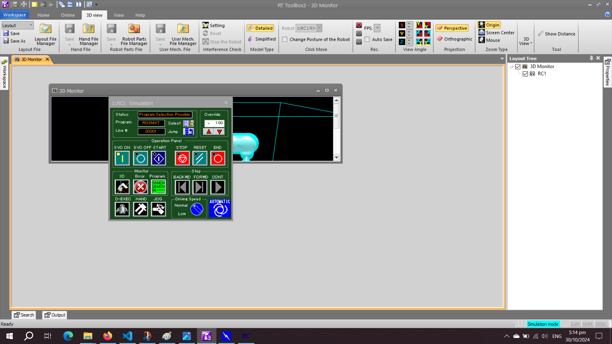

</br>

Select the __blue START__ button found on the __green panel__. 

<br/>
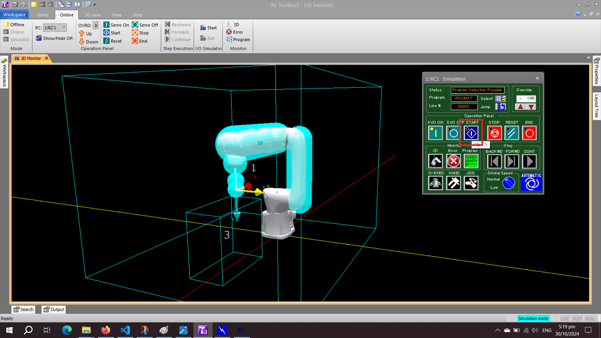

</br>

Your MELSOFT simulators are ready! Let's start the [tutorial!](melfa_masterclass.md)